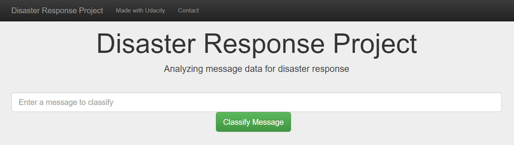
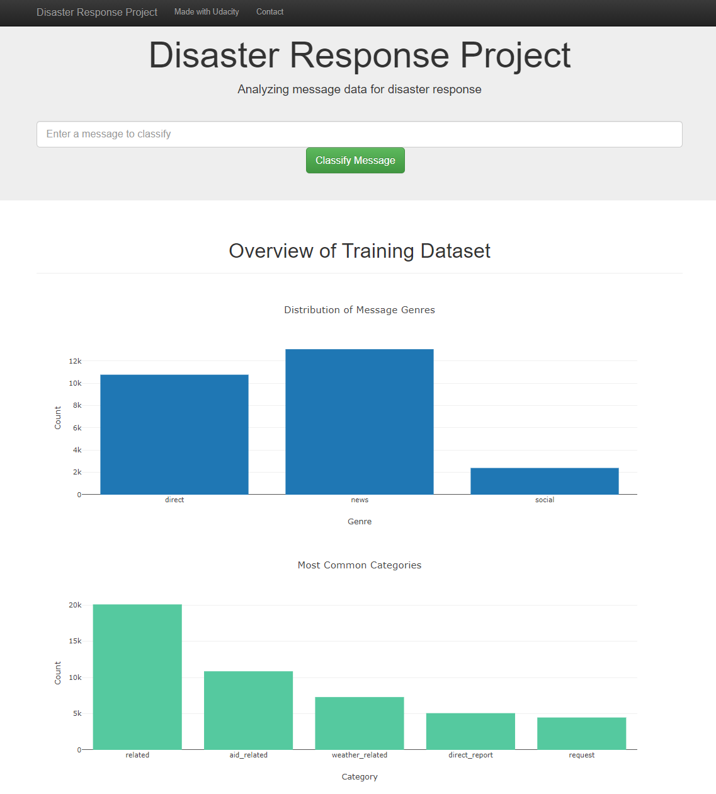

# Disaster Response Pipeline Project (Udacity)

## Project Summary

This project is part of the Data Scientist Udacity Nanodegree Program in collaboration with Figure Eight. The goal is to analyze real life disaster messages and train a model that classifies which organization the message should be sent to. You can see some analysis results and try out the classifier when you run the API.

## Getting Started

### Technical Requirements

* Python 3.6+
* Pandas
* scikit-learn
* nltk
* sqlalchemy
* flask
* plotly

### Instructions
1. Run the following commands in the project's root directory to set up your database and model.

    - To run ETL pipeline that cleans data and stores in database
        `python data/process_data.py data/disaster_messages.csv data/disaster_categories.csv data/DisasterResponse.db`
    - To run ML pipeline that trains classifier and saves
        `python models/train_classifier.py data/DisasterResponse.db models/classifier.pkl`. 
        You can change the parameters

2. Run the following command in the app's directory to run your web app.
    `python run.py`

3. Go to http://0.0.0.0:3001/

## Important Files

* **data/process_data.py**: ETL pipeline to preprocess data and save them in SQLite Database
* **models/train_classifier.py**: Machine Learning pipeline that loads data from the database and trains a multi-output classifier with the disaster messages. 
* **app/run.py**: launches Flask web app 
* **app/templates/***: .html files for the web app

## Screenshot of the Web App

## Credits and Acknowledgments

Must give credit to [Udacity](www.udacity.com) for the project and Data Scientist Nanodegree Program as well as to [Figure Eight](https://www.figure-eight.com/) that provided the dataset and task.

